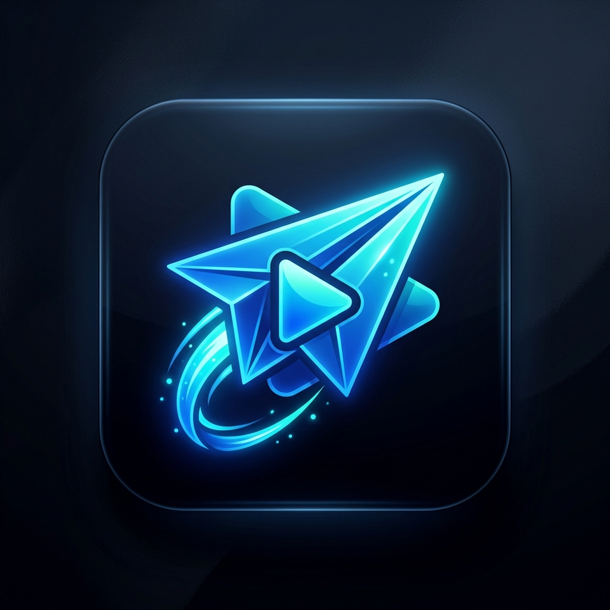

# TeleStream 🚀

<p align="center">
  
</p>

> **Zero-Cost Serverless Telegram Video Streaming App for Android**  
> Built with **Kotlin, Jetpack Compose, AndroidX Media3 (ExoPlayer)**, and an embedded in-app range streaming bridge.

---

## 💡 How It Works (Zero-Cost Architecture)

Traditional video streaming apps require expensive cloud servers (AWS, DigitalOcean, or CDN bandwidth) to store and stream gigabytes of video files.

**TeleStream bypasses all server costs completely:**
1. **Free Cloud Storage & CDN**: Telegram allows uploading files up to 2 GB (4 GB with Premium) for free in private channels.
2. **Device-Embedded Stream Proxy**: An ultra-lightweight HTTP bridge runs directly on `127.0.0.1` inside the Android app.
3. **HTTP Range Scrubbing**: When ExoPlayer seeks backwards or forwards, the embedded bridge intercepts standard `Range: bytes=X-Y` headers and requests those exact chunks directly from Telegram's media servers.
4. **Cloud Build via GitHub Actions**: The APK is compiled and packaged in the cloud for free using GitHub Actions.

```
┌────────────────────────────────────────────────────────┐
│                   Android Device                       │
│                                                        │
│  [ ExoPlayer / Media3 UI ]                             │
│         ▲                                              │
│         │ HTTP 206 Partial Content (Range: bytes=X-Y)  │
│  [ In-App LocalStreamProxy (127.0.0.1:8765) ]          │
└─────────┼──────────────────────────────────────────────┘
          │ Direct HTTPS Chunks
          ▼
   [ Telegram CDN Data Centers ]
```

---

## ✨ Features

- **0 Server Cost**: No backend servers to maintain, pay for, or monitor.
- **AndroidX Media3 (ExoPlayer)**: Smooth adaptive playback, instant seeking, and hardware decoding.
- **Modern Jetpack Compose UI**: Sleek, OLED-dark Netflix/YouTube style interface.
- **Telegram Bot / Channel Integration**: Configure your free bot token from `@BotFather` to stream files from any private channel.
- **Direct Stream URL Support**: Stream direct MP4/MKV video links or Telegram file IDs.
- **Automated Cloud Builds**: Every push to GitHub builds an installable `.apk` file automatically.

---

## 🛠️ Build APK on GitHub (Zero Local Setup)

You don't need Android Studio or Java installed on your computer.

### Step 1: Push to GitHub
```bash
git add .
git commit -m "Initial commit"
gh repo create TeleStream --public --source=. --push
```

### Step 2: Download your APK
1. Open your repository on GitHub in a browser.
2. Go to the **Actions** tab.
3. Select the latest **Build TeleStream APK** run.
4. Under **Artifacts**, click **TeleStream-Debug-APK** to download the installable `.apk` file directly to your Android device!

---

## 📱 Telegram Setup (100% Free)

1. Open Telegram and message [@BotFather](https://t.me/botfather).
2. Create a new bot with `/newbot` and copy your **Bot Token**.
3. Create a private Telegram channel and add your bot as an **Administrator**.
4. In the TeleStream app, tap the **Settings** icon (top right) and paste your **Bot Token**.
5. Upload videos to your channel and stream them immediately!

---

## 📄 License
MIT License.
